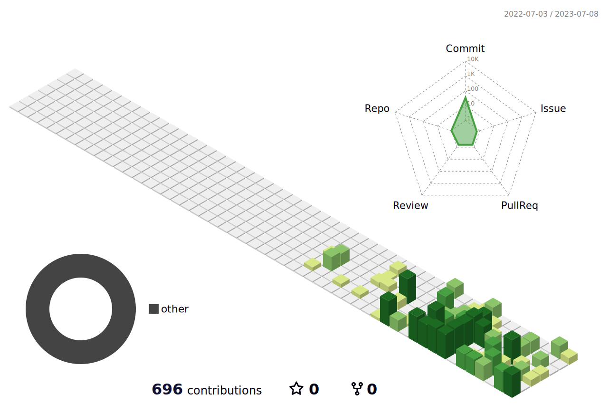

  <h1 style="color:red">Hi there, I'm Taiki Ishikawa 🐮</h1>
  
I'm a 4th-year undergraduate student at Tokyo University of Technology, conducting research on neural networks.

  
Currently, I am also working as an intern and focusing on web development.

  <h2>❤️ I love coding with ...</h2>
  

    
    
    
    
    
    
    
    
    
    
    
    
    
    
    
    
    
    
    
    
    
    
    
    
    
    
    
    
    
    
    
    
    
    
    
    
    
    
    
    
    
    
  

  <h2>🖥️ My GitHub Status</h2>
  

    
    
    
  

  <h2>🎧 I'm listening to ...</h2>
  

